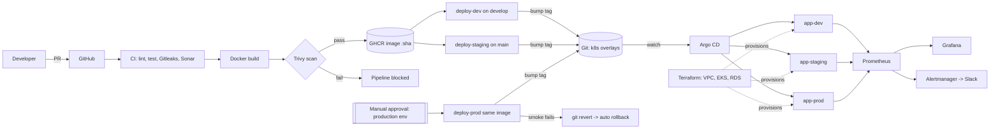

# Architecture

## Key design decisions
| Decision | Why |
|---|---|
| Build once, promote the SHA-tagged image | What was tested in staging is byte-for-byte what runs in prod |
| GitOps with Argo CD (pull) | Git is the audit log; cluster creds never leave the cluster; `selfHeal` reverts drift |
| CI does not touch the cluster | CI only needs to write to Git and GHCR |
| Kustomize overlays | Per-env replicas, limits, host, image tag with no templating |
| OIDC to AWS | No long-lived keys in GitHub |
| RDS `manage_master_user_password` | DB password lives in Secrets Manager, never in Terraform state or Git |
| Rollback = `git revert` | Same path as deploy; fully audited |
| Remote state S3 + DynamoDB lock | Safe concurrent runs, versioned state |

## Branch / environment mapping
| Branch | Environment | Gate |
|---|---|---|
| `develop` | dev | CI green |
| `main` | staging | CI green + smoke test |
| `main` (manual `Deploy Production` run) | prod | Required reviewers + smoke test + auto-revert |
